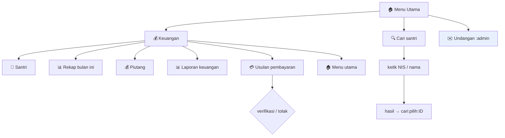

# 09 — Struktur Menu & Role Access (Bot Internal)

> Kondisi terkini setelah RFC-014 (+amendemen 2026-08-18). Satu-satunya sumber pada
> setiap penegakan izin adalah `packages/core` (AGENTS.md); bot menyembunyikan
> tombol/perintah di luar hak peran sebagai lapisan UX, bukan pengganti core.
> Peran yang terpetakan di bot saat ini: **admin** (`ADMIN_TELEGRAM_IDS`) dan
> **bendahara** (`BENDAHARA_TELEGRAM_IDS`). `pengurus`/`pengajar` menyusul via
> `pengguna_telegram` (RFC-009/014, belum dibangun).

## Diagram (Mermaid)

## Menu tombol

| Scaffold | Tombol (callback) | admin | bendahara |
|---|------|:--:|:--:|
| Menu utama | 💰 Keuangan (`menu:keuangan`) | ✅ | ✅ |
| Menu utama | 🔍 Cari santri (`menu:cari`) | ✅ | ✅ |
| Menu utama | ✉️ Undangan (`undangan:list`) | ✅ | — |
| 💰 Keuangan | 👤 Santri (`keu:santri`) | ✅ | ✅ |
| 💰 Keuangan | 📊 Rekap bulan ini (`keu:rekap`) | ✅ | ✅ |
| 💰 Keuangan | 💰 Piutang (`keu:piutang`) | ✅ | ✅ |
| 💰 Keuangan | 📊 Laporan keuangan (`keu:laporan`) | ✅ | ✅ |
| 💰 Keuangan | 💳 Usulan pembayaran (`keu:usulan`) | ✅ | ✅ |
| 💰 Keuangan | 🏠 Menu utama (`menu:utama`) | ✅ | ✅ |

## Perintah teks

| Perintah | Fungsi | admin | bendahara |
|---|------|:--:|:--:|
| `/start` | Orientasi, menu utama | ✅ | ✅ |
| `/cari <nis/nama>` | Cari santri | ✅ | ✅ |
| `/status <nis>` | Status tagihan santri | ✅ | ✅ |
| `/rekap` | Rekap bulan ini (komponen pertama) | ✅ | ✅ |
| `/piutang` | Piutang (komponen pertama) | ✅ | ✅ |
| `/laporan [YYYY-MM]` | Laporan keuangan (bendahara/pengurus) | ✅ | ✅ |
| `/terbitkan` | Terbitkan tagihan SPP bulanan (back office) | ✅ | ✅ |
| `/undang` | Daftar + buat undangan wali | ✅ | — |
| `/bayar <nis> <nom> ` | Catat pembayaran manual | ✅ | — |
| `/setujui <thn>-<bln>` | Setujui bulan Hijriah provisional | ✅ | — |

> Legenda: ✅ boleh · — tidak (tombol disembunyikan; perintah menolak).
> **Admin selalu lolos** — ia induk semua peran (peranCukup di core).