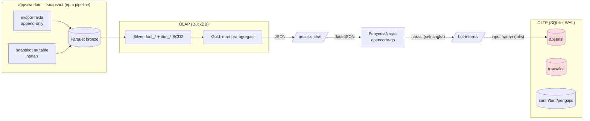

<!--
  RFC-018 — Pipeline Lapis Analitik (Bronze/Silver/Gold) — operasionalisasi ADR 0001 & ADR 0002.
  Status: Draft (review Hani).
-->

# RFC-018: Pipeline Lapis Analitik (Bronze/Silver/Gold) — Pemisahan OTLP/OLAP

| Field | Value |
|---|---|
| **Status** | Draft |
| **Category** | Architecture / Data Pipeline |
| **Author** | Hani Perkasa — Data Architect |
| **Date** | 2026-08-24 |
| **Reviewers** | Tim core siakad (peran bot pengurus) — perlu konfirmasi siapa |
| **Updates / Obsoletes** | — |
| **Relates to** | RFC-016 (chat analisis), RFC-017 (absensi), ADR 0001 (SQLite↔DuckDB), ADR 0002 (OLAP 3 lapis + SCD2), RFC-002 (pipeline v14, konteks korporat — beda domain) |
| **Decision deadline** | {{TBD — Hani set}} |

## Ringkasan Eksekutif

`/analisis` saat ini membaca agregat **langsung ke SQLite OLTP** lewat `repoLaporan`/`repoAbsensi`, sementara lapisan analitik yang dikunci ADR 0002 (bronze/silver/gold) **belum dibangun** — `packages/analytics` masih stub. Karena volume kecil (±150 santri) hal ini aman, tetapi begitu laporan tumbuh, beban baca analitik bisa menyentuh/mengunci DB transaksional dan mengganggu input harian. Solusinya: **rangkai pipeline lapis analitik** — worker mengambil snapshot dari SQLite ke **Parquet (bronze, append-only)**, DuckDB memodelkan **silver** (star schema + SCD2) dan **gold** (mart pra-agregasi), lalu `/analisis` membaca **DuckDB/gold**, bukan SQLite. **Keputusan yang diminta:** setujui membangun pipeline ini sebagai milestone, dengan gold mart awal sejajar ke-3 tool `/analisis`, dan jalur baca analitik dipisah tegas dari jalur tulis transaksional.

---

## 1. Problem Statement

- **Apa masalahnya** (netral): Esensi gagal pisah jalur baca analitik dari jalur tulis transaksional. Laporan sekarang dieksekusi langsung di atas skema OLTP (SQLite), sehingga beban query analitik ikut menumpang mesin yang sama dengan input harian.
- **Bukti**:
  - `packages/analytics/src/index.ts` = stub (`export const PAKET = 'analytics'`), tidak ada pipeline bronze/silver/gold.
  - `apps/worker/src/index.ts` hanya notifikasi/reminder (`kirimNotifikasiTerbit`, `kirimReminderJatuhTempo`, `kirimReminderHijriah`) — tidak ada snapshot→Parquet.
  - `/analisis` menghitung agregat via `repoLaporan`/`repoAbsensi` langsung pada SQLite (lapisan `analisis-chat.ts` di `packages/core`).
  - ADR 0001 & 0002 sudah komit pemisahan, tapi belum direalisasi kode.
- **Sejak kapan / frekuensi**: Sejak RFC-016 (lapisan deterministik `/analisis`). Belum berdampak karena volume kecil.
- **Kenapa sekarang**: Mengikuti ADR 0002 §Konsekuensi — *"pipeline harus hidup sejak awal, bukan menyusul"*; SCD2 hanya merekam perubahan setelah ia jalan, dan OLTP menimpa sejarah. Menunda berarti kehilangan riwayat periode yang sudah lewat secara permanen.

## 2. Terminologi & Definisi

| Istilah | Definisi (dalam dokumen ini) | Catatan / batasan |
|---|---|---|
| OTLP / transaksional | Skema penyimpanan keadaan (SQLite, WAL) — sumber kebenaran, gcara tulis semula | Bukan untuk query analitik |
| OLAP / analitik | Lapisan baca untuk agregat/laporan (DuckDB atas Parquet) | Read-only, tak pernah ditulis dari alur input |
| Medallion | Nama nahum untuk lapisan **Bronze/Silver/Gold** layanan (sinonim ADR 0002 "tiga lapis") | Dipakai untuk bagian bronze/silver/gold |
| Bronze | Fakta mentah diekspor **append-only** per periode; tabel mutable di-snapshot harian | Tak pernah ditulis ulang (audit/re-run) |
| Silver | `fact_*` & `dim_*`, star schema; **SCD2** pada dimensi yang berubah | Konformasi tipe + kunci + riwayat |
| Gold | Mart pra-agregasi yang dibaca laporan/agent | Output JSON ke LLM lewat `/analisis` |
| SCD2 | Slowly Changing Dimension tipe 2 — menyimpan riwayat lewat `valid_from`/`valid_to` | Untuk dim_santri, dim_jenis_tagihan, dim_pengajar (ADR 0002) |
| Snapshot | Salinan keadaan immutable pada satu titik waktu | Menjadi sumber bronze |

## 3. Konteks & Latar Belakang

- Arsitektur saat ini: SQLite OLTP (WAL, embedded) + DuckDB embedded (ADR 0011 — tanpa container DB; data = berkas). `data/` berisi SQLite, Parquet, ekspor — tidak pernah masuk git.
- Batasan: stack **TypeScript-saja** (ADR 0002 menolak dbt/Python; transformasi = berkas SQL plain dijalankan runner TS kecil). Skala kecil (~180 ribu baris/tahun) → bangun ulang full tiap malam hitungan detik, tanpa incremental state.
- Keputusan terdahulu: ADR 0001 (SQLite OLTP, DuckDB OLAP), ADR 0002 (bronze/silver/gold + star schema + SCD2, dim_waktu Masehi+Hijriah, tanpa dbt). Guard "Angka dari SQL, kalimat dari model" dan "Angka turunan tidak disimpan" berlaku.

## 4. Scope

### In scope
- Pipeline snapshot dari SQLite → **Parquet bronze** (fakta append-only per periode, mutable di-snapshot harian).
- Pemodelan **silver**: `fact_*` + `dim_*` (SCD2 pada dim_santri, dim_jenis_tagihan, dim_pengajar; dim_waktu Masehi+Hijriah).
- **Gold mart** awal sejajar 3 tool `/analisis`: `ringkasan_laporan`, `tren_pembayaran_spp`, `tren_absen_santri`.
- Runner transformasi TypeScript + berkas SQL plain (sesuai ADR 0002), npm scripts.
- **Isolasi performa**: kebijakan index panas + WAL pada OLTP; jalur baca analitik hanya lewat DuckDB/gold.
- Cutover `/analisis` deterministik agar membaca gold (bukan repo OLTP), dengan mode dual-run saat transisi.
- Uji yang membuktikan lapisan nyata (test ADR 0002: pindah santri → histori periode lama tetap di kelas lama).

### Out of scope — keputusan eksplisit

| Hal | Alasan dihilangkan | Kapan dievaluasi lagi |
|---|---|---|
| Konsumen non-`/analisis` (Metabase, Google Sheets) | Sudah disebut konsumen gold di ADR 0002, tetapi belum ada permintaan runtime; fokus dulu `/analisis` | Saat ada kebutuhan report/tampilan eksternal |
| Pemodelan akademik penuh (nilai, hafalan, poin, PR) | Belum ada tabel/data — tunggu RFC skema akademik | Saat RFC akademik terbit |
| Sinkronisasi ke platform korporat (BigQuery/base_procurement) | Domain berbeda; chapter RFC-002 korporat | Proyek terpisah |
| dbt / incremental state / watermark | ADR 0002: tidak terpakai di skala ini, menambah Python | Tidak direncanakan |

## 5. Goals & Non-Goals

### Goals (terukur)
- Query analitik/`/analisis` **tidak lagi menyentuh tabel OLTP** → baca hanya dari DuckDB/gold. *Ukuran: tidak ada `READ`/`SELECT` langsung ke tabel transaksi dari jalur analitik (divalidasi review kode + test).*
- Pipeline idempoten: bangun ulang full bronze→silver→gold konsisten, selesai < ~10 detik untuk volume tahunan. *Ukuran: runtime pengukuran npm script pipeline.*
- `tren_*` mempertahankan riwayat walau master berubah. *Ukuran: test ADR 0002 (pindah santri) hijau.*
- Perubahan input harian (tulis) **tidak** diblokir oleh beban report. *Ukuran: /analisis dan pencatatan absensi/transaksi jalan serentak tanpa kontensi mengunci ditambah.*
- 0 duplikasi definisi agregat: mart gold satu-satu dengan tool `/analisis`. *Ukuran: pemetaan tool→gold view.*

### Non-Goals
- Tidak mengubah skema OLTP (grain transaksi tetap).
- Tidak membuat konsumen report non-`/analisis` sekarang.
- Tidak menambahkan dbt/Python ke stack.

## 6. Opsi yang Dipertimbangkan

| # | Opsi | Kelebihan | Kekurangan | Keputusan |
|---|---|---|---|---|
| 1 | Report baca langsung SQLite (status quo) | Tanpa biaya baru | Mencampur OLTP/OLAP; beban tumbuh; tak ada riwayat SCD2 | Ditolak — melawan ADR 0001/0002 |
| 2 | DuckDB `ATTACH` ke SQLite langsung | Satu query path | Bukan lapisan analitik (skema OLTP = keadaan, bukan sejarah); ADR 0002 menolak | Ditolak — sudah dibahas ADR 0002 |
| 3 | Medallion penuh bronze/silver/gold di Parquet+DuckDB | Riwayat + isolasi + mart siap-pakai; audit-independen | Perlu bangun worker + runner | **Dipilih** — persis ADR 0002 |
| 4 | Flat snapshot tunggal baru dikonversi ke medallion nanti | Mulai cepat | Kerja ganda; delay riwayat SCD2; melanggar "pipeline sejak awal" | Ditolak — langsung medallion |
| 5 | dbt untuk orkestrasi | Standar industri | SDK Python, incremental tak terpakai, stack jadi campur | Ditolak — ADR 0002 |

## 7. Solusi yang Diusulkan

### 7.1 Prinsip / asumsi dasar
- **Tulis = OLTP; baca analitik = DuckDB.** Pemisahan di-enforce di arsitektur, bukan sekadar kebiasaan.
- Parquet langsung dalam bentuk **medallion** (bronze→silver→gold) sejak awal — bukan snapshot flat dulu.
- Transformasi = SQL plain + runner TS kecil; idempoten (bangun ulang full).
- Gold = satu-satunya sumber yang dikonsumsi model (`/analisis`), menjaga "Angka dari SQL".

### 7.2 Desain
**Bronze (Parquet, tak pernah ditulis ulang):**
- Fakta diekspor **append-only per periode/bulan**; tabel mutable (santri, tarif, pengajar, mapping) di-**snapshot harian**.
- Partisi default `tahun`/`bulan` Parquet di `data/parquet/bronze/`.
- Grain = grain OLTP (per kejadian), belum diagregasi.

**Silver (DuckDB `data/db/analisis.duckdb`):**
- `fact_*` (fakta SPP, transaksi, absensi) + `dim_*` (santri SCD2, jenis_tagihan SCD2, pengajar SCD2, waktu Masehi+Hijriah).
- Konformasi tipe, resolusi kunci, normalisasi nama.

**Gold (mart pra-agregasi):**
- Mapping 1-1 ke tool `/analisis`:
  | Tool `/analisis` | Gold mart/view |
  |---|---|
  | `ringkasan_laporan` | `mart_ringkasan` (terbit/masuk/sisa per periode×komponen) |
  | `tren_pembayaran_spp` | `mart_tren_spp` (per santri per periode) |
  | `tren_absen_santri` | `mart_tren_absen` (per santri per bulan: hadir/izin/sakit/alpa) |
- Output diserahkan sebagai JSON ke `analisis-chat` / penyedia narasi (LLM) sesuai guard.
  - **Catatan pemotongan & approach**: gold mart menggantikan `repoLaporan`/`repoAbsensi` untuk jalur `/analisis`.

### 7.3 Diagram

### 7.4 Perubahan yang dibutuhkan

| Komponen | Perubahan | Pemilik |
|---|---|---|
| `apps/worker` | Tambah tugas snapshot: ekspor fakta (append-only) + snapshot mutable harian → Parquet bronze | Tim core |
| `packages/analytics` | Implementasi: runner SQL TS + skrip bronze→silver→gold (bukan stub) | Tim core |
| `packages/core` (`analisis-chat.ts`) | Cutover agregat: baca gold mart (bukan repo OLTP), mode dual-run saat transisi | Tim core |
| `packages/db` | (Opsional) kebijakan index panas & konfirmasi WAL pada tabel panas `absensi`, `transaksi`, `tagihan` | Tim core |
| `data/` | Direktori Parquet/DuckDB; ekspor masuk `.gitignore` (sudah) | — |

## 8. Analisis Dampak

| Dimensi | Dampak | Keterangan |
|---|---|---|
| Bisnis / operasional | Laporan berdampak kecil, tidak menabrak input harian; riwayat SCD2 tersedia | Manfaat jangka panjang untuk presensi & tunggakan |
| Teknis / infrastruktur | Tambah worker snapshot + DuckDB/Parquet (embedded, tanpa container baru) | Volume bronce ~25 MB/thn (ADR 0002) |
| Data (model, kualitas, lineage) | Definisi agregat satu tempat (gold); riwayat tak hilang | Lineage bronze→silver→gold jelas |
| Organisasi / proses | Pipeline jadi bagian alur; butuh pemilik & jadwal snapshot | ADR 0002 "hidup sejak awal" |
| Kepatuhan / tata kelola | Audit laporan bisa di-re-run dari bronze | Bronze immutable |

## 9. Risiko & Mitigasi

| # | Risiko | Prob (T/M/R) | Dampak (T/M/R) | Mitigasi | Pemilik |
|---|---|---|---|---|---|
| 1 | SCD2 mulai telat → kehilangan riwayat periode | M | T | Backfill dari snapshot master; mulai segera | Tim core |
| 2 | Double source saat transisi (/analisis baca gold vs repo) menyimpang | M | T | Dual-run: bandingkan gold vs repo; cutover setelah konsisten | Tim core |
| 3 | Pipeline gagal membangun gold (baris N/A) | M | M | Idempoten; verifikasi build ulang + test ADR 0002 | Tim core |
| 4 | Query gold bertambah cepat dari volume | R | R | Bangun ulang full < detik; optimasi index/partisi bila perlu | Tim core |

## 10. Rencana Transisi & Implementasi

- **Fase 1 — Pipeline inti**: worker snapshot (bronze) + runner bronze→silver→gold untuk 3 tool awal. (Implementasi)
- **Fase 2 — Dual-run**: `/analisis` menjalankan agregat dari gold DAN repo; bandingkan (uji konsistensi) tanpa memutuskan alur.
- **Fase 3 — Cutover**: `/analisis` baca gold saja; matikan jalur baca repo dari lapisan analitik.
- **Transisi**: dual-run bertahan sampai perbedaan antar sumber = 0 pada set uji riwayat.
- **Rollback**: kembalikan flag cutover ke repo; gold tetap ada untuk append.
- **Go/No-go**: Fase 2 → 3 hanya bila test ADR 0002 + uji konsistensi hijau.

## 11. Verifikasi & Acceptance Criteria

| # | Kriteria | Cara verifikasi | Siapa |
|---|---|---|---|
| 1 | Test ADR 0002 hijau (pindah santri, histori tetap di kelas lama) | Unit test pipeline | Tim core |
| 2 | `ringkasan`/`tren *` dari gold == nilai deterministik repo saat ini | Uji konsistensi dual-run | Tim core |
| 3 | Jalur analitik tidak `SELECT` tabel OLTP | Review kode + grep import repo di jalur analitik | Tim core |
| 4 | Pipeline idempoten & selesai < 10 detik | `time npm run pipeline:analisis` | Tim core |

## 12. Output — Before / After

| Aspek | Sebelum | Sesudah |
|---|---|---|
| Jalur baca `/analisis` | SQLite OLTP (`repoLaporan`/`repoAbsensi`) | DuckDB gold (mart) |
| Lapisan analitik | Stub (`PAKET='analytics'`) | Bronze→Silver→Gold nyata |
| Riwayat periode | Tertimpa di OLTP | SCD2 di silver; bronze immutable |
| Isolasi performa | Input & report sekontainer | Baca analitik terpisah dari tulis |
| Runtun runtime | Query per-request | Mart pra-agregasi (baca cepat) |

## 13. Open Questions — Request for Comments

| # | Pertanyaan | Dibutuhkan dari | Deadline | Status |
|---|---|---|---|---|
| 1 | Frekuensi & jam snapshot default (usulan: harian malam) | Hani / Tim core | {{TBD}} | Open |
| 2 | Gold mart menggantikan `repoLaporan`/`repoAbsensi` untuk `/analisis` — setuju cutover penuh? | Hani / Tim core | {{TBD}} | Open |
| 3 | Siapa pemilik & penanggung jawab operasional pipeline (SLA snapshot jika gagal)? | Hani | {{TBD}} | Open |
| 4 | Backfill awal SCD2: mulai dari periode mana? (usulan: dari mulai pipeline berjalan, sesuai ADR) | Hani / Tim Medis | {{TBD}} | Open |
| 5 | Perlu jadwal/rutin untuk konsumen gold non-`/analisis` (Sheets/Metabase) — sekarang atau nanti? | Hani | {{TBD}} | Open |

## 14. Keputusan & Sign-off

| Keputusan | Oleh | Tanggal | Status |
|---|---|---|---|
| Bangun pipeline lapis analitik bronze/silver/gold (operasionalisasi ADR 0001/0002) | Hani Perkasa | 2026-08-24 | {{Menunggu}} |

## 15. Referensi

- ADR 0001 — SQLite untuk OLTP, DuckDB untuk OLAP
- ADR 0002 — OLAP berlapis dengan star schema dan SCD Type 2
- ADR 0011 — Docker sebagai fondasi infrastruktur (embedded DB)
- RFC-016 — chat analisis terpagar (`/analisis`)
- RFC-017 — modul absensi

---

## Lampiran A — Decision Log

| Tanggal | Keputusan | Pemicu | Oleh |
|---|---|---|---|
| 2026-08-24 | Medallion langsung sejak awal (bukan snapshot flat dulu) | Pertanyaan Hani: "parquet medallion sekalian?" — ADR 0002 sudah mengunci 3 lapis | Hani |

## Lampiran B — RFC Mini (untuk keputusan cepat)

**Keputusan yang diminta:** Setujui membangun pipeline lapis analitik bronze/silver/gold sebagai milestone dan `/analisis` baca gold mart (cutover bertahap).
**Konteks singkat (3 kalimat):** `/analisis` sekarang membaca SQLite OLTP langsung; ADR 0002 sudah mengunci gudang 3 lapis (bronze/silver/gold) tapi belum dibangun. Pemisahan ini mencegah beban report menyentuh/mengunci input harian saat volume tumbuh, dan menyimpan riwayat yang OLTP timpa.
**Opsi:** (A) medallion penuh sekarang — direkomendasikan; (B) flat snapshot dulu, medallion nanti (ditolak: kerja ganda, riwayat telat); (C) biarkan status quo (ditolak: melawan ADR).
**Rekomendasi:** A — medallion penuh, karena ADR 0002 sudah menguncinya dan menghindari rework, dengan dual-run sebelum cutover.
**Dampak jika salah:** Jika ditunda, riwayat periode yang lewat hilang permanen (SCD2 baru merekam setelah hidup).
**Deadline:** {{TBD — Hani set}}